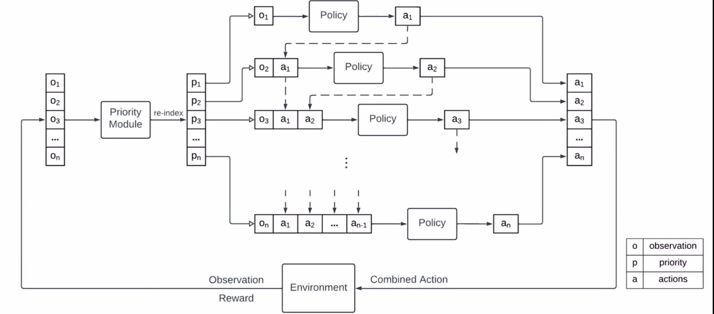
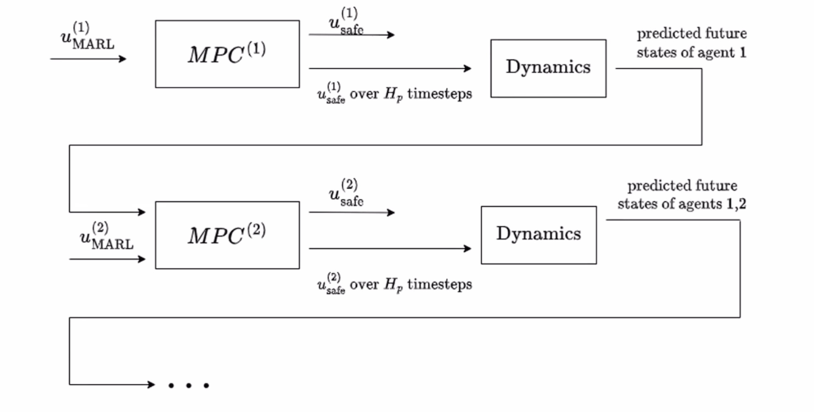

# rounD


## Install
Open a terminal, navigate to where you want to clone this repo. Then run the following commands:

```
conda create --name your-env-name python=3.8
conda activate your-env-name
pip install -r requirements.txt
conda list
```


## How to Use
- Open and run `reinforcement_learning/testing_mappo_cavs.py` to simulate with pretrained model.

- Open and run `imitation_learning/get_feature_from_dataset.py` to generate processed data for training.
- Open and run `imitation_learning/train.py` to train a imitation learning model.

- Open and run `reinforcement_learning/training_mappo_cavs.py` to train a reinforcement learning model. During training, all the intermediate models that have higher performance than the saved one will be saved.

- `scenarios/road_traffic.py` defines the training environment, such as reward function, observation function, etc. Besides, it provides an interactive interface, which also visualizes the environment. Use `arrow keys` to control agents and `tab key` to switch between agents.





